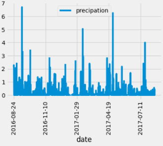
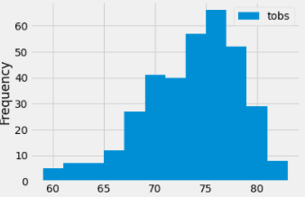
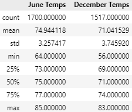

# Module 9: Surf's Up with Advanced Data Storage and Retrieval
## Resources

- **Data Sources:** 
  - Hawaii SQLite Database [hawaii.sqlite](Resources/hawaii.sqlite)
- **Software:** Python, SQLAlchemy, JupyterLab, SQLite, Numpy, Pandas, Matplotlib, Flask

## Challenge Project Overview 

Using tools such as SQLAlchemy, Python, and JupyterLab, I connected to and queried an SQLite database. Then I wrote and executed Python code using Numpy, Matplotlib, and Pandas to view statistics like minimum, maximum, and averages to analyze and visualize the data about weather. Finally, I built a basic Flask app to view the JSONified data. With this data, we could locate an ideal surf shop location. Maybe in Hawaii???

To view the basic Flask app data, navigate to the folder where app.py and hawaii.sqlite is found. Open a terminal and type "run flask." You then will go to http://127.0.0.5000/ to view the results.

## Challange Project Analysis

1) Precipitation should not be a factor in picking a location. According to the data, a rainy month can occur during any season of the year in Hawaii.

2) Temperature is a much better factor when picking a location in Hawaii because surfers will be more likely to surf when the weather is warm. With most temperatures hovering around the 70-80 range, Hawaii appears to be warm enough to have great surfing conditions. But averages do not tell us if that kind of temperature is evenly spread throughout the year or lumped into certain months. 

 

3) The average temperatures only tell us one part of the story. We now need to ask ourselves if that is year-round or mostly in the summer months. By comparing June and December temperature statistics and looking at the max and minimum temperatures, we can see there are not any major outliers impacting the average temperature data. The average temperature in June is about 75 F, 4 degrees higher than the average temperature in December. This small temperature difference is not enough to impact business at any time of year.

## Challange Project Summary

Using all our data, we can observe while December is slightly cooler, it's not a big enough weather difference to dissuade surfers from hitting waves in the winter months. The seasonal temperature differences are so insignificant that we can rest easy knowing we won't have to close shop during anytime of the year. 

To further pick our location, I would like to write queries to:
1) Look into summary statistics of temperatures recorded by the station for each month. This way we could identify the best location with the best weather in Hawaii.
2) Next, surfing is not only about temperatures. The WAVES are the most important part. We need to dive into the wind condition data to truly pick the best location. 
 
